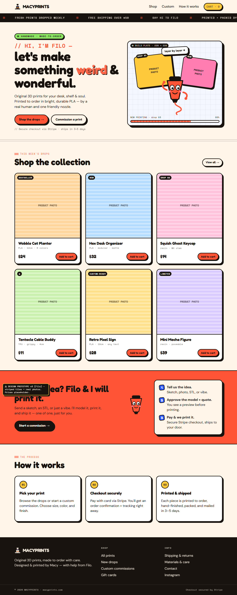

# MACYPRINTS

Original, made-to-order 3D prints — a bold & playful storefront with custom Stripe checkout.
Brand mascot: **Filo**, a friendly extruder nozzle. 🧡



## Stack

- **Vite + React + TypeScript** front end
- **Tailwind CSS** for the neo-brutalist design system (cream/coral palette, hard shadows, Fredoka type)
- **Express** API (`server/`) that creates **Stripe Checkout** sessions
- Cart state in React context, persisted to `localStorage`

## Quick start

```bash
npm install
npm run dev
```

- Web: http://localhost:5173
- API: http://localhost:3001 (Vite proxies `/api` here)

With no Stripe key configured, the app runs in **DEMO mode** — the full
add-to-cart → checkout → success flow works without taking a real payment.

## Going live with Stripe

1. Create a free account at https://stripe.com and grab your **test** keys:
   https://dashboard.stripe.com/test/apikeys
2. Copy `.env.example` → `.env` and set:
   ```
   STRIPE_SECRET_KEY=sk_test_...
   PUBLIC_URL=http://localhost:5173
   ```
3. Restart `npm run dev`. Checkout now redirects to real Stripe Checkout (test
   mode — use card `4242 4242 4242 4242`, any future expiry/CVC).
4. When ready for real money, swap in your **live** secret key and set
   `PUBLIC_URL` to your production domain (e.g. `https://macyprints.com`).

> Prices are **server-authoritative**: the API looks up each cart line's amount
> from `shared/products.json` by id, so the client can never alter prices.

## Editing the catalog

All products live in [`shared/products.json`](shared/products.json) — used by
both the client (display) and the server (pricing). To add a print:

```jsonc
{
  "id": "my-new-print",          // unique slug, must be unique
  "name": "My New Print",
  "blurb": "One playful sentence.",
  "priceCents": 2600,            // $26.00
  "currency": "usd",
  "badge": "NEW",                // optional pill, or ""
  "material": "PLA",
  "size": "10 cm",
  "tint": "#FFD49A",             // base color for the placeholder until you add a photo
  "colorChips": ["#FF5436", "#2D5BFF"],
  "image": ""                    // set to "/products/my-new-print.jpg" once you have a photo
}
```

### Adding real product photos

Drop images in `public/products/` and set each product's `image` field to
`/products/<file>.jpg`. The card automatically swaps the layer-line placeholder
for your photo. Square images (1:1) look best.

## Project structure

```
shared/products.json     # single source of truth for the catalog (client + server)
server/index.js          # Express API: Stripe Checkout session + /api/health
src/
  components/            # Filo, Logo, Nav, Footer, Marquee, ProductCard, BuildPlateHero, CartDrawer, Button
  pages/                 # Home, Success, Cancel
  lib/                   # cart context, checkout client
  data/products.ts       # typed catalog loader + price formatting
design/                  # the design exploration that led here (v1 → v2 → v3 Filo)
```

## Deploy

Configured for **Vercel** (`vercel.json`). The static site builds to `dist/`.
For production checkout you'll also need the API running — either as a Vercel
Serverless Function or a small always-on Node host — with `STRIPE_SECRET_KEY`
and `PUBLIC_URL` set as environment variables.

## Scripts

| command | what it does |
|---|---|
| `npm run dev` | web + API together (with hot reload) |
| `npm run build` | typecheck + production build to `dist/` |
| `npm run preview` | preview the production build |
| `npm start` | run just the API server |
